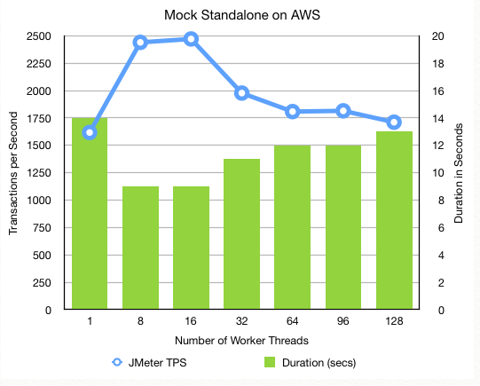
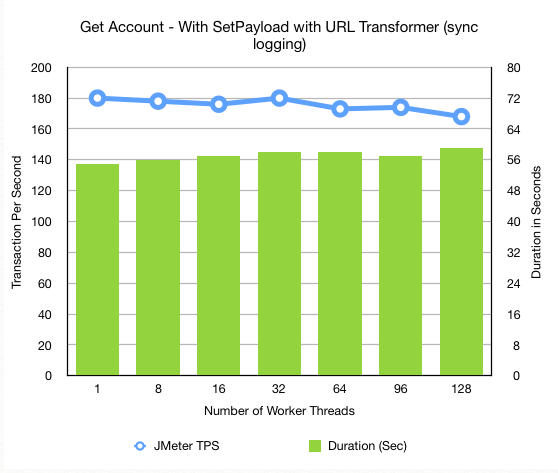
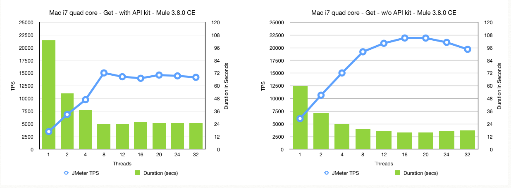

**Interop Performance Testing Documentation**

**Goals of interop performance testing**

As part of the overall performance testing for the Gates OSS
LevelOneProject, one of the key performances area we wanted to ensure
were tested for performance and was as fast as possible were the
Interop- services provided by ModusBox. These various services are
proxied through for nearly every call and therefore are key ensuring
that the overall system is performing well.

So the goal of testing all of the interop services is to ensure that the
interop services are not the bottleneck and that they are performing up
to key standards and metrics.

In addition to the above testing, part of our goal is to develop a set
of testing tools, processes and procedures so that we can apply them to
other LevelOneProject areas to help ensure that all areas of the
LevelOneProject are performing well and that we and identify problem and
slow areas of the system.

**Testing Environment**

In our initial performances testing, we primarily focused on testing
only Interop services on the “perf isolated” or interop standalone AWS
server, which is an M4Large. This is a dual core CPU with 8GB of RAM.
Mule was configured with 1GB RAM for initial and max heap size. This
server provides an isolated environment so we can test independently
from other services so we can identify potential bottleneck areas, fix
them and rerun the tests to see the results.

**Tools that were used**

The following is a list of the testing tools used for performing these
initial tests:

**JMeter 3.1** — User to run the scripts that executed various HTTP API
Resources

**Metrics** — ModusBox’s tools for measuring and viewing performance
results

**Mule Runtime Service Mocks** — For hosting service Mocks to simulate
various service dependences that key interop services required to run

**Testing Overview**

The big picture of the interop ILP ledger testing follows the following
pattern:

1.  Create an initial DFSP 1 & 2 user accounts in a CSV format that
    feeds into the JMeter scripts

2.  Determine which services you want to test

    1.  Get Accounts

    2.  Prepare Transfer or

    3.  Fulfill Transfer

3.  Run the JMeter script with a particular user load (threads) to
    achieve the desired load and testing results. Typically, when
    testing just the Interop ILP ledger in isolation that general range
    of worker threads is between 2 and 32.

4.  Observe the results using the Metrics UI to see the
    various statistics.

For the interop isolated test, we created the user data accounts in step
1 above then duplicated the CSV rows to create a much larger data set.
Some of the tests needed to ensure that the test ran long enough to see
the statistical trends and to allow Metrics to see various metrics, we
created CSV with 180,000 records.

**JMeter Scripts **

As part of the interop ILP ledger performance testing, three JMeter
scripts were created to test each service independently:

1.  interop-Ledger-GetAccount-Standalone.jmx

2.  interop-Ledger-PrepareTransfer-Standalone.jmx

3.  interop-Ledger-FulfillTransfer-Standalone.jmx

The word “Standalone” in the script indicates that it is configured to
point for the Interop Standalone AWS server.

The interop-Ledger-GetAccount-Standalone.jmx script is configured to
call the GET resource using the following URL:
/ilp/ledger/v1/accounts/${senderAccountId}. The ${senderAccountId} is
the JMeter variable that is populated when the JMeter script is run and
loads data from CSV data file. The ${senderAccountId} in our test data
files is the generated ID when the initial account was created in a DFSP
and we use this to pass to the service test so make each call unique and
to ensure that cashing is not used.

The interop-Ledger-PrepareTransfer-Standalone.jmx script is configured
to call the PUT resource on the following URL:
**/ilp/ledger/v1/transfers/${senderfUUID}**.

In order to run theses JMeter scripts, JMeter needed to be installed on
the interop standalone server. JMeter was installed in
/home/ubuntu/jmeter/apache-jmeter-3.2 and the path to the bin directory
was added the ubuntu .profile so it is already in the path.

**Testing Approach **

The goals for these tests were to perform various performance-oriented
tests against the Interop ILP Ledger services to gather initial
performance metrics as a baseline and so we have initial knowledge of
how our initial deployments are performing. There services we initially
focused on were the Get Accounts, Prepare Transfer and Fulfill Transfer.
These were selected as they represented the core functionality and
performed the most business logic that would help us determine a
representative performance metric. The assumption here is that if these
services performed well the other services would perform equally as
well.

The approach to testing the Interop Services was to first mocks all
services needed for testing the Interop ILP Ledger. This required the
creations of 5 service mocks:

-   PUT for /transfers/{id}/fulfillment

-   GET for /transfers/{id}

-   GET for /transfers/{id}/fulfillment

-   GET for /accounts/\*

-   PUT for /transfers/{id}

These mocks provided the necessary data for the various services in the
interop ILP ledger to work unmodified.

With the mocks in place, the general approach is the run the JMeter
scripts to test a specific service and observe the results.

**Steps to running the performance tests**

**To run the Get Account service:**

1.  Log into the interop standalone server
    ([ec2-34-209-21-199.us-west-2.compute.amazonaws.com](http://ec2-34-209-21-199.us-west-2.compute.amazonaws.com))
    by using the following command:

ssh -i "interop-dev1.pem"
ubuntu@ec2-34-209-21-199.us-west-2.compute.amazonaws.com

1.  Change directories to
    /home/ubuntu/performance\_tests/jmeter\_scripts

    1.  This directory contains all the needed JMeter scripts and
        data file. The JMeter scripts are configured to be run from
        this directory.

2.  Enter the following command line to run the Get Account JMeter
    script:

jmeter -n -t interop-Ledger-GetAccount-Standalone.jmx -J UserThreads=4

This will test the GetAccount service by calling the RESTful endpoint
using data from the configured CSV file, currently with 10,000 records.
It will run and produce the following output:

*Creating summariser &lt;summary&gt;*

*Created the tree successfully using
interop-Ledger-GetAccount-Standalone.jmx*

*Starting the test @ Thu Jun 22 21:00:41 UTC 2017 (1498165241584)*

*Waiting for possible Shutdown/StopTestNow/Heapdump message on port
4445*

*summary + 3843 in 00:00:18 = 212.7/s Avg: 16 Min: 5 Max: 108 Err: 0
(0.00%) Active: 4 Started: 4 Finished: 0*

*summary + 6156 in 00:00:25 = 251.0/s Avg: 15 Min: 4 Max: 69 Err: 0
(0.00%) Active: 0 Started: 4 Finished: 4*

***summary = 9999 in 00:00:43 = 234.7/s Avg:** 16 Min: 4 Max: 108 Err: 0
(0.00%)*

*Tidying up ... @ Thu Jun 22 21:01:24 UTC 2017 (1498165284529)*

*... end of run*

The line above in bold tells us that it processed all 9,999 records,
took 43 seconds and averaged 234.7 transactions per second.

**To run the prepare transfer service:**

1.  Log into the interop standalone server
    ([ec2-34-209-21-199.us-west-2.compute.amazonaws.com](http://ec2-34-209-21-199.us-west-2.compute.amazonaws.com))
    by using the following command:

ssh -i "interop-dev1.pem"
ubuntu@ec2-34-209-21-199.us-west-2.compute.amazonaws.com

1.  Change directories to
    /home/ubuntu/performance\_tests/jmeter\_scripts

    1.  This directory contains all the needed JMeter scripts and
        data file. The JMeter scripts are configured to be run from
        this directory.

2.  Enter the following command line to run the Get Account JMeter
    script:

jmeter -n -t interop-Ledger-PrepareTransfer-Standalone.jmx -J
UserThreads=4

**To run the fulfill transfer service:**

1.  Log into the interop standalone server
    ([ec2-34-209-21-199.us-west-2.compute.amazonaws.com](http://ec2-34-209-21-199.us-west-2.compute.amazonaws.com))
    by using the following command:

ssh -i "interop-dev1.pem"
ubuntu@ec2-34-209-21-199.us-west-2.compute.amazonaws.com

1.  Change directories to
    /home/ubuntu/performance\_tests/jmeter\_scripts

    1.  This directory contains all the needed JMeter scripts and
        data file. The JMeter scripts are configured to be run from
        this directory.

2.  Enter the following command line to run the Get Account JMeter
    script:

jmeter -n -t interop-Ledger-FulfillTransfer-Standalone.jmx -J
UserThreads=4

**Initial Observations and Results**

These performance tests yielded some interesting and unexpected
findings, while other tests performed as expected.

***Mock Testing***

Our initial performance test was running against the Mule mocks to
ensure or verify that they were not introducing any performance issues.
These results came back with very high numbers. As you can see from the
graph below, we reached maximum performance or throughput at 16 threads
of 2,500 transactions per second. The pattern of adding more threads
yield expected performance patters: as we add more threads we saw
increasing improved performance until we hit the server’s maximum
capacity, then as we continue to add more threads, performance will
start to degrade. The conclusion: Mocks performed as expected.

***Interop ILP Ledger Adapter testing***

Our next set of performance tests were focused on testing the Interior
ILP Ledger adapter services, Get Account, Prepare Transfer and Fulfill
Transfer. The transfer services contain various Mule components and
transformers and are the most complicated of all our other services.
Here is where we found some unexpected results.

Like all of our tests, we start out with a single worker thread to see
the results of easiest possible test, then increase the number of worker
threads to observe how the increase load affects the results. As we
continued to add more worker threads, the transactions per second were
expected to increase, like the Mule mocks did, but that did not happen.
This puzzled us. As you can see from the graph below, the more worker
threads neither increased the transactions per second nor did it degrade
(much).

This result was very unexpected and strange. This left us with no choice
to dig deep into the situation to understand what the root cause was for
both the slower than expected TPS as well as the behavior of adding more
worker threads yield no improved or degraded performance. We looked for
potential offenders and removed them or worked around them. For example,
we commented out all Loggers (as there were synchronous based loggers),
we removed all transformers, and changed flow references from Flow to
Sub-Flow to see of the thread handoff was affecting performance. Nothing
changed and the performance numbers and behavior stayed the same.

We finally got down to the final item left in the equation that we could
change, and that is how the initial HTTP connector hands off the request
to the Mule Flows for processing. With RAML-based APIs, API Kit Router
is used to route the request based on the HTTP request (HTTP Verb and
URL Resource). When we tested this Mule component in isolation we
discovered that this API Kit router is adding approximately 30
milliseconds to every call and behaved as if has code this single
threaded or has a Synchronized method property.

On a large isolated test, we see that plain HTTP requests, not going
through the API Kit router, is on average about 4x faster than when
routing through the API Kit router.

In the graphs below, two exact services were deployed and one on the
left was process or routed with the API Kit router and the one on the
right was a plain HTTP connector. This test was run on a Mac Book Pro
with an Intel quad core i7. This chip has hyper threading which makes
the OS think that it actually has 8 CPU cores (two per actual core). As
you can see in the graph on the left, that performance improved all the
way up to 8 threads then it flat lined. The graph on the right, with the
plain HTTP connector and no API Kit router, performance continued to
improve with more worker threads until it maxed out at around 20
threads.

For whatever reason the Mule API Kit Router has some limitations and the
only way to work around it is to either increase the number of CPU cores
or to eliminate the API Kit router and replace with more verbose code by
using an HTTP connector for HTTP Verb / Resource combination. The latter
is not desirable as it requires rewriting code and eliminates the use
and advantage of RAML.

**Conclusion**

The good news is that all of the Interop code, outside of the API Kit
Router, is performing really, really well and averages sub-millisecond
per call. Once we or MuleSoft fixes or provides a work around to the API
Kit Router issue, we will easily reach our performance target of our
Interop services reaching &gt; 300 TPS.

ModusBox will be submitting a ticket to MuleSoft for assistance in
understanding the API Kit situation as this is important to resolve.
